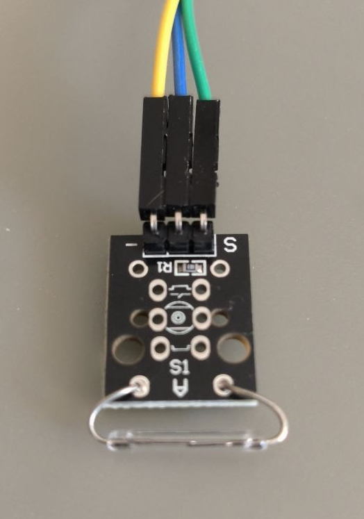

# Arduino Sensor Assembly & Connection Manual

This document provides guidelines for assembling the hardware sensor part of the manual VR treadmill using an Arduino board and connecting it to a computer.

---

## 1. Required Components

1. **Arduino Board**: Almost any model will work (Arduino Uno, Nano, Pro Micro, Mega).
2. **Sensor**: Magnetic Reed Switch OR a Digital Unipolar Hall Effect Sensor (e.g. A3144 or KY-003 module).
3. **Resistor**: **10 kOhm** resistance (for signal pull-up, required for standard reed switch or bare Hall sensor chips).
4. **Magnet**: Neodymium magnet, to be attached to the wheel or shaft of the treadmill.
5. **USB Cable** to connect the board to the PC.
6. Connecting wires.

---

## 2. Wiring Diagrams (Reed Switch or Hall Effect Sensor)

Both sensors work like a switch: they pull the signal down to GND when a magnet is brought close. To prevent signal noise when the switch is open, we use a pull-up configuration to the 5V power line.

### Option A: Standard Reed Switch with External Resistor
1. Connect **one contact of the reed switch** to pin **A0** on the Arduino.
2. Connect the **second contact of the reed switch** to **GND** (Ground) on the Arduino.
3. Install a **10 kOhm resistor** between pin **A0** and pin **5V** (this ensures a stable pull-up level when the switch is open).

### Option B: Reed Switch Module (KY-025 or similar)
If you are using a pre-assembled reed switch sensor module, it already has the required resistor built-in. Connect it as follows:
- **`S` (Signal)** to pin **A0** on the Arduino.
- **`-` (Ground)** to **GND** on the Arduino.
- **Middle pin (VCC)** to **5V** on the Arduino.

### Option C: Digital Hall Effect Sensor (KY-003 module or A3144 chip)
A unipolar digital Hall sensor acts as a solid-state replacement for a reed switch. It registers magnetic fields without mechanical contact and works seamlessly with the same firmware.

If you are using a **KY-003 module**:
- **`S` (Signal)** to pin **A0** on the Arduino.
- **`-` (Ground)** to **GND** on the Arduino.
- **Middle pin (VCC / +)** to **5V** on the Arduino.

If you are using a **bare A3144 chip** (looking at the front face with the text and chamfered edges):
1. Connect the left pin (**VCC**) to **5V**.
2. Connect the middle pin (**GND**) to **GND**.
3. Connect the right pin (**OUT**) to pin **A0** on the Arduino.
4. Install a **10 kOhm pull-up resistor** between pin **A0** (OUT) and **5V**.

> [!NOTE]
> **Magnet Polarity:** Hall sensors are sensitive to magnet polarity (usually triggering on the South pole). If the sensor does not trigger when the magnet passes by, flip the magnet 180 degrees.

> [!WARNING]
> **Avoid Latching Sensors:** Do not use latching/bipolar Hall sensors (like US1881), as they require an opposite magnetic pole to turn off, which will not work with a single magnet.

*When the magnet is far from the sensor, input A0 reads HIGH (the firmware translates this and sends `0` to the serial port). When the magnet passes by, it pulls the pin to GND, so input A0 reads LOW (the firmware translates this and sends `1` to the serial port).*

---

## 3. Firmware Installation

1. Download and install the free **[Arduino IDE](https://www.arduino.cc/en/software)**.
2. Connect the Arduino board to the PC using a USB cable. Windows will automatically install the necessary COM port drivers.
3. Open Arduino IDE and load the firmware:
   * The firmware is located at: `arduino_sensor/arduino_sensor.ino`
4. In the top menu of Arduino IDE, select your board model and COM port:
   * **Tools -> Board** -> Select your model (e.g. *Arduino Nano*).
   * **Tools -> Port** -> Select the COM port assigned to your board (e.g. *COM3*).
5. Click the **Upload** button (the right arrow icon on the top panel) and wait for the *“Done uploading”* message at the bottom of the screen.

---

## 4. Operational Check

Once the firmware has uploaded successfully, you can test the sensor directly in the Arduino IDE:
1. Go to **Tools -> Serial Monitor** or press `Ctrl+Shift+M`.
2. In the bottom-right corner of the Serial Monitor window, set the communication speed to: **115200 baud**.
3. You will see a continuous stream of values showing `0`.
4. Bring the magnet close to the reed switch — the values should instantly switch to `1`. When the magnet is moved away, the values must immediately return to `0`.

*If everything is working correctly, close the Arduino IDE (to free the COM port) and start the main application `VRTreadmill.exe`.*
