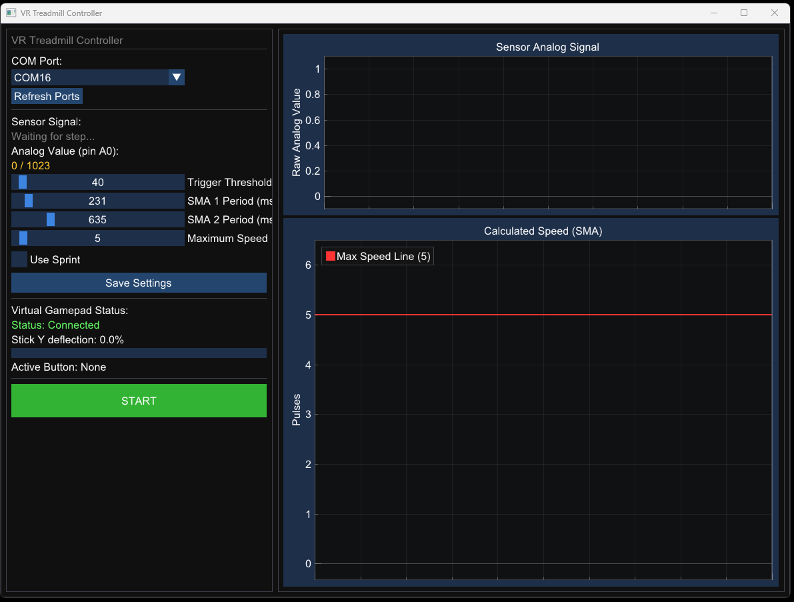
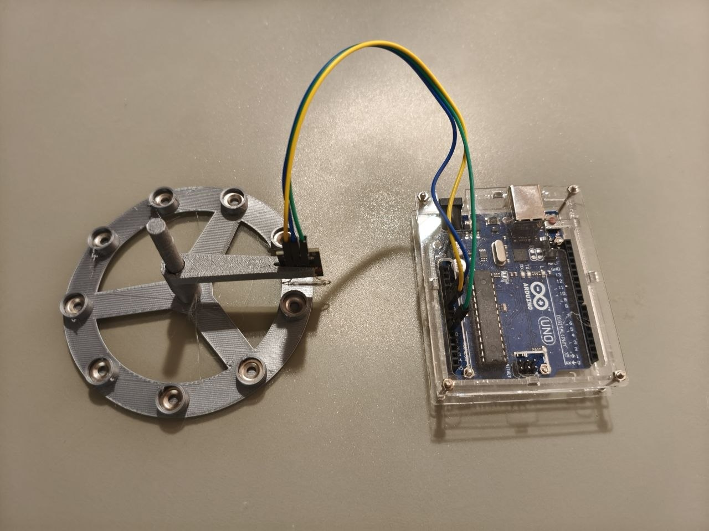

# VR Treadmill Controller

A high-performance C++ utility with a Direct3D 11 + Dear ImGui interface designed to read serial data from a VR manual treadmill sensor and emulate virtual Xbox 360 controller inputs.

This project translates physical walking speed (detected via magnetic reed switch sensors connected to an Arduino) into analog joystick inputs and button presses on a virtual gamepad.



## Demo Video

Watch the controller in action inside VRChat: **[VRChat DIY Manual VR Treadmill Demo (YouTube)](https://www.youtube.com/watch?v=ba-zsTXx3EM)**

---

## Features

- **High-Rate Digital Sensor Stream**:
  - Arduino firmware operates at **1000 Hz** (1ms sampling) sending digital state (`1` for magnet near, `0` for magnet far).
  - High-performance non-blocking serial communication client on Windows with low latency.
  - Auto-detection: dynamically adapts to either digital `0/1` input or legacy `0 - 1023` analog signals.
- **Cascaded Double Simple Moving Average (SMA)**:
  - **SMA 1**: Counts the number of active switch trigger events within a sliding window (configurable, e.g. 3000ms).
  - **SMA 2**: Performs secondary smoothing over the calculated speed values (configurable, e.g. 500ms) to ensure smooth transitions.
- **100Hz Simulation Physics Loop**: Runs a fixed-interval `10ms` simulation tick to guarantee stable movement decay and response.
- **Analog Joystick & Sprint Buttons mapping**:
  - **Proportional Stick Deflection**: Joystick deflection scales linearly with speed relative to the **Maximum Speed** setting (clamped at 100% / 1.0 when exceeded).
  - **Configurable Sprint (L3/R3/A/B/X/Y/LB/RB)**: Actively presses and holds a chosen controller button when the smoothed speed crosses the user-configurable orange **Sprint Threshold** line.
- **Double-Graph Real-time Oscilloscope**:
  - **Sensor Analog Signal (Top)**: Plots the raw sensor state (digital `0/1` or analog `0 - 1023`) along with the Trigger Threshold.
  - **Calculated Speed (Bottom)**: Displays raw pulse counts (SMA 1, blue), the smoothed velocity curve (SMA 2, green), Maximum Speed limit (red line), and Sprint threshold (orange line).
  - Displays a clean, smooth, rolling 5-second timeline without X-axis tick labels for a clean aesthetic.
- **Diagnostics Status Panel**: ImGui left panel shows real-time virtual controller status, current thumbstick Y-axis deflection progress bar, and active buttons.
- **Config Persistence**: Save all configuration variables (limits, thresholds, COM port) to a local `config.txt` file which loads automatically on startup.

---

## Hardware Setup

1. **Arduino Sensor**: Connect a magnetic reed switch to pin `A0` of your Arduino board. One contact of the switch connects to pin `A0`, the other to `GND`. Add a `10 kOhm` pull-up resistor between `A0` and `5V`.
2. **Firmware**: Upload the code in the `arduino_sensor` folder to the board. The sensor reads values and sends them to the PC via USB Serial at **1000 Hz**.
3. For detailed guide see [ARDUINO_SETUP.md](file:///c:/wsl/manual_treadmill/ARDUINO_SETUP.md).



---

## Requirements & Software Setup

1. **Virtual Gamepad Driver**: Install the [ViGEmBus](https://github.com/ViGEm/ViGEmBus) driver on your system. This allows the application to create a virtual Xbox 360 controller.
2. **Windows OS**: The GUI is optimized for Windows 10/11 using MSVC compiler toolchain.

---

## Compilation

Build the project from the `cpp_app` subdirectory:

1. Open the Developer Command Prompt for Visual Studio.
2. Navigate to the `cpp_app` directory.
3. Run the automated build script:
   ```powershell
   cmd /c build.bat
   ```
4. The compiled executable `VRTreadmill.exe` will be located in the `cpp_app/build/` directory.

---

## GUI Parameters

- **Trigger Threshold**: Configures the signal deflection delta from the center baseline (1023) required to count a sensor trigger (used in analog mode only).
- **SMA 1 Period (ms)**: The window size used to count sensor triggers (pulses).
- **SMA 2 Period (ms)**: The window size used to smooth out speed transitions.
- **Maximum Speed**: The pulse count target that triggers a 100% forward joystick output.
- **Use Sprint**: Checkbox to toggle sprint emulation.
- **Sprint Threshold**: Speed threshold to trigger sprint.
- **Sprint Button**: Combo box to select which Xbox 360 controller button to trigger when sprinting.
